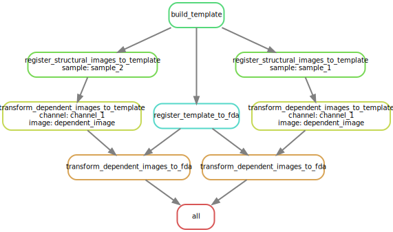
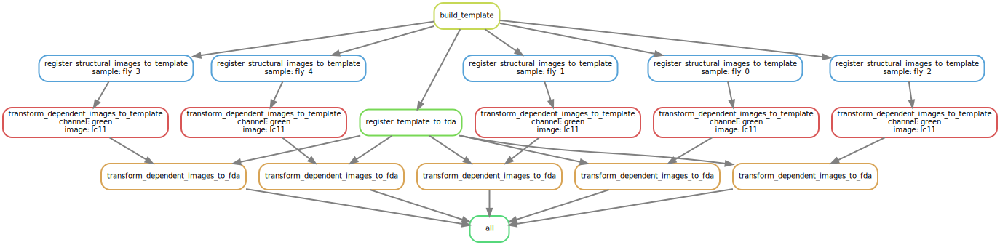

# bifrost

Template building and multi-modal registration

# System Requirements

## Hardware Requirements

Image registration is a memory-intensive computation.  For example, it takes on the order of 128G of
memory to register 32-bit images of shape (1652, 768, 479).

`bifrost` makes use of all available cores. Note that determinism is only
guaranteed when running in single-threaded mode.

## Software requirements

`bifrost` fully supports *nix and was tested on CentOS 7 running Python 3.9.0.
It may be possible to install `bifrost` on Windows and MacOS but these platforms
are not officially supported. A [docker](https://docs.docker.com/get-started/)
image is provided which can be used on all platforms.

Python >=3.8 is required.

`bifrost` was tested against snakemake 7.30.2. snakemake 8 moved to a plugin
architecture for slurm support which may result in slight CLI differences.

Refer to `setup.py` for a full list of dependencies.

# Installation

```
pip install git+ssh://git@github.com/ClandininLab/bifrost.git
```

Installation takes about two minutes on a computer with a fast internet
connection and an empty `pip` cache.

## Docker

As an alternative to local installation, you may use docker.

Build the BIFROST docker image by running

```
docker build /path/to/bifrost-repo --tag bifrost:latest
```

You can then drop into a shell in a ready to go environment with

```
docker run --name bifrost --rm -it bifrost:latest bash
```

# Usage

There are two ways to use `bifrost`. You can directly interface with our tooling
via the `bifrost` executable or you can use the provided [Snakemake](https://snakemake.readthedocs.io/en/stable/)
implementation of the BIFROST pipeline which handles plumbing and (optionally) distributed execution.

## Using the executable

The `bifrost` executable (installed by `pip`) provides interfaces to all BIFROST logic.
There are three subcommands:

- `bifrost register`
- `bifrost transform`
- `bifrost build_template`

`bifrost register` computes the transformation between two
images using SynthMorph and uses it to register them. `bifrost transform`
applies that transform to other images. `bifrost build_template` builds a
statistically representative "mean image" from a series of individual images
which often registers more accurately to a reference template than the
individual images.

See the interactive help for each subcommand for detailed usage instructions.

## The BIFROST pipeline

The BIFROST pipeline registers images from a dataset of $N$ samples with $M$
channels and an arbitrary number of time points into the space of the Functional
Drosophila Atlas (FDA) which was published as part of the BIFROST paper (available [below](#artifacts)). We provide an
implementation of the BIFROST pipeline in the form of an easy to use
[Snakemake](https://snakemake.readthedocs.io/en/stable/) workflow that
transparently scales from single-node to cluster execution.

The BIFROST pipeline consists of the following steps:

1. A representative "mean" template is created from the structural images of each sample
2. Each structural image is independently registered to the template, producing a transform from each sample to the shared template
3. The template is registered to the FDA, producing a transform from the shared template to the FDA
4. Each dependent image for each sample is transformed in sequence into the space of the shared template and then FDA using the transforms computed in the previous two steps

Steps which do not depend on each other proceed in parallel so long as
sufficient resources are available.

A toy dataset with two samples, a single channel and a single dependent image for each sample has the following dependency graph:



In this example a maximum of three steps execute simultaneously.


The degree of parallelism increases dramatically for more realistic datasets. For instance, this is the dependency graph for the (still unrealistically small) demo dataset:



For a dataset with $N$ samples, $M$ channels each of which has $K$ dependent
images there are $2 + N + 2 N K M$ steps in the pipeline. Up to $1 + N K M$ steps
can proceed in parallel. As each step can take on the order of an hour to
complete, serial execution would be prohibitively slow. The beauty of Snakemake
is that it transparently orchestrates the distributed execution of the pipeline
on your favorite cluster/cloud platform.


### Data requirements

You must provide your data as NIfTI images with intact metadata. Take care to
match the affine to that of the FDA you use. In our experience the vast majority
of registration failures are caused by incorrect metadata.

In order to be correctly parsed by the Snakemake workflow you must follow a
prescribed directory structure. Under your top-level dataset directory there
must be a directory named `templates` containing only the FDA and a directory
`data`. `data` contains $N$ arbitrarily named directories, one for each sample.
Each sample directory must contain a structural image file
`structural_image.nii` and can contain any number of arbitrarily named channel
directories. Each channel directory can contain any number of arbitrarily named
NIfTI images (the `.nii` suffix is mandatory).

The channel images are dependent upon the structural image and assumed to be
motion-corrected and perfectly aligned to it.

Some examples:


The toy dataset used to generate the first dependency graph image:
```
toy_dataset
├── data
│   ├── sample_1
│   │   ├── channel_1
│   │   │   └── dependent_image.nii
│   │   └── structural_image.nii
│   └── sample_2
│       ├── channel_1
│       │   └── dependent_image.nii
│       └── structural_image.nii
└── templates
    └── FDA.nii
```

The demo dataset (second dependency graph image):
```
demo_dataset
├── data
│   ├── fly_1
│   │   ├── green
│   │   │   └── lc11.nii
│   │   └── structural_image.nii
│   ├── fly_2
│   │   ├── green
│   │   │   └── lc11.nii
│   │   └── structural_image.nii
│   ├── fly_3
│   │   ├── green
│   │   │   └── lc11.nii
│   │   └── structural_image.nii
│   └── fly_4
│       ├── green
│       │   └── lc11.nii
│       └── structural_image.nii
└── templates
    └── FDA.nii
```

Channel and images names are arbitrary and not shared across samples:

```
example
├── data
│   ├── foo
│   │   ├── channel_bar
│   │   │   ├── img_1.nii
│   │   │   └── img_2.nii
│   │   ├── channel_foo
│   │   │   ├── image_1.nii
│   │   │   ├── image_2.nii
│   │   │   └── image_3.nii
│   │   └── structural_image.nii
│   ├── bar
│   │   ├── qux
│   │   │   ├── image_1.nii
│   │   │   └── image_2.nii
│   │   └── structural_image.nii
│   └── baz
│       └── structural_image.nii
└── templates
    └── FDA.nii
```

### Running the pipeline

To use the pipeline you must install the `bifrost` package using `pip` _and_ clone this
repository to a location of your choice to obtain the `Snakefile` defining the
pipeline and associated configuration files.

By default, `snakemake` expects to be executed from a workflow directory
containing a `Snakefile`. The bifrost workflow directory is named `pipeline`.
If you do not wish to execute `snakemake` from a workflow directory, you will
have to set the `--snakefile` and `--configfile` arguments.

#### Single-node execution

To execute the pipeline in single-node mode using up to 24 cores on the node
with each job using up to 8 cores, run the following command from within the `pipeline`
directory of this repo.

```
snakemake --cores 24 --config max_threads=8 --directory /path/to/your/dataset
```

#### Distributed execution


Running the following command from within the `pipeline` directory of this repo
would execute the the pipeline on nodes with 16 CPUs and 128GB of memory (see
[configuration](#configuring-the-pipeline)) using as many as 64 simultaneous
jobs.

```
snakemake --slurm --jobs 64 --profile cluster_profile --config max_threads=16 --directory /path/to/your/dataset
```

In this scenario, if there were more than 64 tasks that could be be
executed simultaneously (this depends only on the dependency graph), snakemake
would submit 64 jobs to the Slurm scheduler and then wait for jobs to finish
before submitting more.

The `snakemake` process simply coordinates jobs and does no heavy lifting
itself. It must be executed from an environment containing slurm executables, so
run it on a login node or as its own job. An [example sbatch script](pipeline/example_sbatch.sbatch) is provided.

Please refer to the Snakemake docs for instructions on how to execute the
pipeline on
[cloud](https://snakemake.readthedocs.io/en/stable/executing/cloud.html)
resources and other
[cluster](https://snakemake.readthedocs.io/en/stable/executing/cluster.html)
scheduling systems.


### Configuring the pipeline

User configurable `bifrost` parameters are exposed via a mandatory configuration
file. The config file must be named `config.yaml` and placed in your dataset
directory (alongside `data` and `templates`). An [example config file](pipeline/example_config.yaml)
with good defaults is provided.

You can modify the parameters by editing the config file or using snakemake's
`--config` argument. For example, you could override the default value for `affine_steps` with

```
snakemake --cores 16 --directory /path/to/your/dataset --config "parameters={'build_template': {'affine_steps': 1}}"
```

Refer to `bifrost --help` for details about the parameters.

The configuration also contains a max threads declaration which you should set
to an appropriate value for your hardware.

#### Slurm configuration

For Slurm execution an additional configuration file specifying account,
partition and requested memory allocation is required. This file is referred to
as a "profile" by snakemake. An [example profile file](pipeline/cluster_profilfe/config.yaml) is provided.

Unlike the main configuration file which must be placed in your dataset
directory (or specified with `--configfile`), the profile file must reside in a
directory named something like `cluster_profile` with the workflow directory.
i.e. if you use the `pipeline` directory in the repo as your workflow
directory, it should stay where it is.

The requested CPU allocation is specified separately by the max threads
declaration in the main configuration file.


### Processing time series imagery

Time series data can be processed by storing each sample as its own image. Note
that you can have any number of dependent images in each channel. 4D NIfTIs are
not supported (but contributions are welcome!).

For instance:

```
time_series_example
├── data
│   ├── animal_1
│   │   ├── red_channel
│   │   │   ├── tp_1.nii
│   │   │   ├── tp_2.nii
│   │   │   ├── tp_3.nii
│   │   │   ├── tp_4.nii
│   │   │   └── tp_5.nii
│   │   ├── green_channel
│   │   │   ├── tp_1.nii
│   │   │   ├── tp_3.nii
│   │   │   └── tp_5.nii
│   │   └── structural_image.nii
│   ├── animal_2
│   │   ├── red_channel
│   │   │   ├── tp_1.nii
│   │   │   ├── tp_2.nii
│   │   │   ├── tp_3.nii
│   │   │   ├── tp_4.nii
│   │   │   └── tp_5.nii
│   │   ├── green_channel
│   │   │   ├── tp_1.nii
│   │   │   ├── tp_3.nii
│   │   │   └── tp_5.nii
│   │   └── structural_image.nii
└── templates
    └── FDA.nii
```

Each sample will be submitted as a separate job to the scheduler. Submitting
thousands of jobs to slurm will deadlock the scheduler (not just for you, for
your entire institution). Do not do this. If you have more than a couple of
dozen of timepoints, you should group their execution with Snakemake's job
grouping feature.


Here are some resources on how to do that:
- https://snakemake.readthedocs.io/en/stable/executing/grouping.html
- https://github.com/snakemake/snakemake/issues/872
- https://github.com/jdblischak/smk-simple-slurm/tree/main/examples/job-grouping

# Demo

The demo dataset is included in this repository. Install [git
lfs](https://git-lfs.com/) prior to cloning this repository to download it, or
install it and run `git lfs pull` from within the repository if you have already
cloned the repo. This expands the `demo_dataset.tar.gz` stub file.

Once you have unpacked `demo_dataset.tar.gz` to a location of your choice, you
can run the demo by `cd`ing to `pipeline/` and running

```
snakemake --cores all --directory /path/to/demo_dataset
```

This takes about 7 minutes to run on a node with 16 cores.

If all went well, the output of `tree /path/to/demo_dataset` will be

```
demo_dataset
├── data
│   ├── fly_1
│   │   ├── green
│   │   │   └── lc11.nii
│   │   └── structural_image.nii
│   ├── fly_2
│   │   ├── green
│   │   │   └── lc11.nii
│   │   └── structural_image.nii
│   ├── fly_3
│   │   ├── green
│   │   │   └── lc11.nii
│   │   └── structural_image.nii
│   ├── fly_4
│   │   ├── green
│   │   │   └── lc11.nii
│   └── └── structural_image.nii
├── logs
│   ├── build_template.log
│   ├── register_structural_images_to_template_fly_1.log
│   ├── register_structural_images_to_template_fly_2.log
│   ├── register_structural_images_to_template_fly_3.log
│   ├── register_structural_images_to_template_fly_4.log
│   ├── register_template_to_fda.log
│   ├── transform_dependent_images_to_fda_fly_1_green_lc11.log
│   ├── transform_dependent_images_to_fda_fly_2_green_lc11.log
│   ├── transform_dependent_images_to_fda_fly_3_green_lc11.log
│   ├── transform_dependent_images_to_fda_fly_4_green_lc11.log
│   ├── transform_dependent_images_to_template_fly_1_green_lc11.log
│   ├── transform_dependent_images_to_template_fly_2_green_lc11.log
│   ├── transform_dependent_images_to_template_fly_3_green_lc11.log
│   └── transform_dependent_images_to_template_fly_4_green_lc11.log
├── results
│   ├── template.nii
│   ├── template_to_fda
│   │   ├── registered.nii
│   │   └── transform.h5
│   └── transformed_images
│       ├── fly_1
│       │   └── green
│       │       └── lc11.nii
│       ├── fly_2
│       │   └── green
│       │       └── lc11.nii
│       ├── fly_3
│       │   └── green
│       │       └── lc11.nii
│       └── fly_4
│           └── green
│               └── lc11.nii
└── templates
    └── FDA.nii

42 directories, 60 files
```

# Artifacts

## FDA

Three closely related but distinct FDA images are provided, a thresholded
version, an unthresholded version and an (unthresholded) version that complies
strictly with the NIfTI-1 specification. A bridging transformation is available
only for the thresholded version. The NIfTI-1 compliant and unthresholded
versions share the same raster data. The thresholded and unthresholded versions
share the same metadata but have slightly different raster data. The NIfTI
compliant image follows the NIfTI convention for the spatial coordinates of +x =
Right, +y = Anterior, +z = Superior, which is not related by a scaling transform
to the voxel coordinates. The spatial coordinates of the other versions are
related to the voxel coordinates by the identity. If you do not intend to bridge your
dataset to other atlases, it is recommended that you use the NIfTI compliant
version.

- [thresholded FDA](https://drive.google.com/file/d/1Ssf2fSzgCsniXmiQiXEO_wgkpciWuQb5/view?usp=sharing)
- [unthresholded FDA](https://drive.google.com/file/d/1tkyKx-JXFqZ8KbFwGpWaZgFwd-Uk9q9A/view?usp=sharing)
- [NIfTI compliant FDA](https://drive.google.com/file/d/13EiWDQ0d68xGAadMJclpGWcj428WWxvb/view?usp=sharing)

## Bridging transformations

### To JRC 2018

This transform was obtain using the thresholded FDA. It can be applied to images
registered to the unthresholded FDA but is "undefined" outside of the support of the thresholded image.

- [thresholded FDA to JRC 2018 central brain female](https://drive.google.com/file/d/1pT4VYq0xaQoNVEsn7sC_1kZ1WQ8hNlef/view?usp=sharing)

### To other reference brains

 Bridging transformations to other reference brains can be obtained by
 composition using the [navis](https://github.com/navis-org/navis-flybrains) or
 [Jefferis lab](https://github.com/jefferislab/BridgingRegistrations) bridging resources.

## Replication

This dataset can be used to replicate our LC11 registration accuracy result. Cluster execution recommended.

- [replication dataset](https://drive.google.com/file/d/1os6_hDsxd6HmeL0dc91mEWlnwCsYdlR-/view?usp=sharing)

# Known issues

There is a cache invalidation bug affecting `bifrost build_template` when
resuming a partially complete run with different parameters than the original
run. Use `-f` liberally.

# Reference

If you found this tool useful please cite the BIFROST paper.
